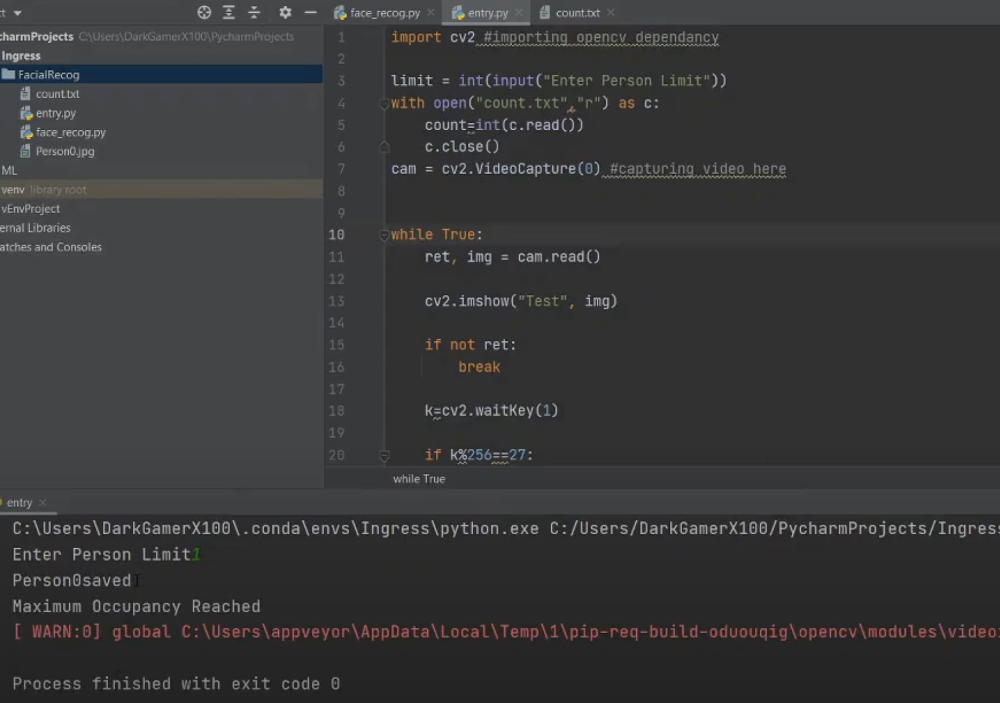

# alphCapture

An improvised prototype of a system that enables monitoring of customers entering or leaving a shop.
- Uses AI imbibed face recognition system to mark the entry and exit instance of customers and updates count.
    - Prototype developed using Python and OpenCV  
    
  
For each face registered at the entry point, a count variable is set that increments till a particular limit.
When maximum limit is reached – alert send to staff 
Similarly, at exit point, the customer's face is registered and compared with the existing images in database.
If a match is found, customer count is decremented, and the the image is removed from the database.
  

Want to know how it works ? 

## Prerequisites

1. Anaconda Environment 
2. Pycharm IDE (Integrate with Conda Environment) 
3. Python “dlib” Library 
    - Install using `pip install dlib` 
    - If that doesnt work, try the [tutorial](https://www.youtube.com/watch?v=lPE5-yOI0CM)  

4. Python “opencv” Library.
  - Install using `pip install opencv-python`  
5. Python “face-recognition” Library
  - Install using `pip install face-recognition` 

You are now ready to download and run this [file](https://drive.google.com/file/d/101JkkZ67_n9jILovuUDgH1BXXCBOgO13/view?usp=sharing) 

[Link](https://drive.google.com/file/d/1vpzdRjNUVrDXegi6lsSI0n7AwJZsb6RX/view?usp=sharing) to demo
