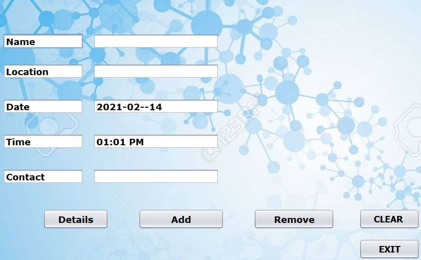

# alphRecord

- A solution to conventional writing of details while entering a store as part of COVID protocol
- A Java application to store the shopper details on a daily basis.
- Enables utility for adding entry, searching and removing an entry
- A refined and faster approach to monitor customer details and to notify other customers of the day, if is a covid case report.

## Prerequisites:
- Java Programming Language, with Netbeans IDE.

- Mysql Backend Database

- JDBC Connectivity

