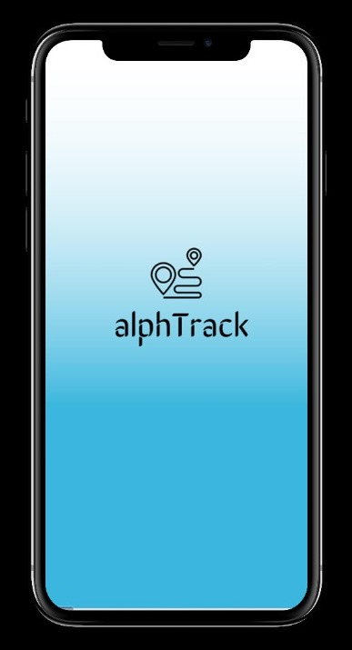

# alphTrack 

- A mobile application in par with a virtual diary
- Users can enter daily logs of their commuting details
- Faster approach to backtrack and alert their visiting sites, if a reported case occurs
- Weekly and monthly entries can be viewed

[Link](https://www.figma.com/proto/MDW7QJMR86vZue7KjSwMQ1/alphTrack?node-id=59%3A280&scaling=scale-down) to prototype
